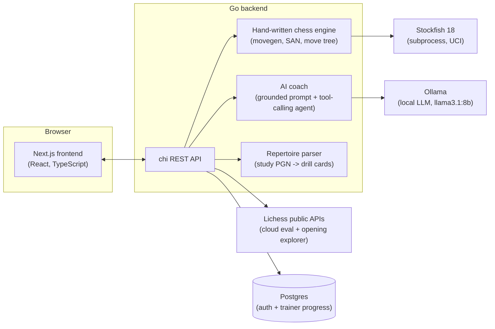

# Chesslab

**A chess study tool** with a real-time analysis board, Stockfish, an AI trainer, opening-study
drills, and a private PDF book workspace. Study your repertoire with spaced repetition, explore
positions with engine-backed coaching, or work directly from your chess books on an interactive
board.

[](backend)
[](frontend)
[](frontend)
[](https://stockfishchess.org/)
[](LICENSE)

---

## Contents

- [What it does](#what-it-does)
- [Analysis Board](#analysis-board)
- [AI Coach](#ai-coach)
- [Opening Study (spaced-repetition trainer)](#opening-study-spaced-repetition-trainer)
- [Study from Book](#study-from-book)
- [Architecture](#architecture)
- [Tech stack](#tech-stack)
- [Getting started](#getting-started)
- [Configuration](#configuration)
- [Testing](#testing)
- [Project layout](#project-layout)
- [Deployment](#deployment)
- [Known issues](#known-issues)
- [License](#license)

## What it does

Chesslab brings several study tools together behind one Go chess engine and one login:

| | |
|---|---|
| **Analysis Board** (`/`) | A Lichess-style opening database + Stockfish analysis board, with move-tree navigation (sidelines included) and an AI coach that explains *this* position, grounded in real engine and book data — not a chatbot guessing at chess. |
| **Opening Study** (`/opening-study`) | Feed it a Lichess study URL and it becomes a spaced-repetition drilling deck: play your repertoire from memory, get corrected instantly, and let a Leitner-style scheduler decide what you see next. |
| **Study from Book** (`/book-study`) | Read one private book chapter at a time beside an interactive board, freely explore each supplied lesson or puzzle position, and keep completion progress per user. |

Everything below the UI is real: legal-move generation, check/mate/stalemate detection, SAN
notation with disambiguation, and move trees with non-destructive sideline navigation are all
hand-written in Go — no chess.js, no python-chess. Stockfish and Lichess's public APIs do the
engine work; a local LLM (via Ollama) does the explaining.

## Analysis Board

A three-column workspace — **Coach | Board | Move order** — around a custom chess.com-styled board.

- **Full legal-move chess engine**, written from scratch in Go: castling (both sides), en passant,
  promotion, check/checkmate/stalemate, the 50-move rule, and insufficient-material draws. Legality
  is computed by applying every pseudo-legal move and checking the resulting king safety, which
  handles pins and discovered checks for free instead of special-casing them.
- **Move tree, not a move list.** Every game is a tree of positions. Navigating backward never
  discards a move; playing a different move from an earlier point creates a sideline instead of
  overwriting history. The move list renders Lichess-style — one row per full move, figurine
  notation, per-move evaluation — with sidelines nested inline.
- **Stockfish 18 + Lichess cloud eval.** Every position is analyzed by Lichess's precomputed
  cloud-eval API first (deep, instant, no auth needed), falling back to a local Stockfish subprocess
  when the position isn't cached. An eval bar and a live depth/score readout sit next to the board.
- **Live Opening Explorer.** Real games-played / win-rate / draw-rate stats from Lichess's database
  (2000+ rated players) for the current position, with each candidate move's own named opening —
  click a row to play it.
- **Drag-and-drop and click-to-move**, chess.com-style right-click arrows and circles, PGN paste
  (discards the board and replays from scratch — a partial/illegal paste loads whatever prefix
  parsed cleanly), and keyboard move navigation.

## AI Coach

Grounded chess coaching, not free-associated chatbot chess. A local LLM (Ollama + `llama3.1:8b` by
default — **no Anthropic API key, no cloud LLM cost**) writes the prose, but it never invents a
chess fact: every claim it makes is backed by Stockfish, Lichess, or a curated, engine-validated
opening-theory corpus.

**Two ways to ask:**

- **"Ask Coach"** — a one-click, grounded explanation of the move just played. It retrieves book
  commentary for the *exact* position from a hand-chunked, engine-validated theory corpus, runs a
  rule-based move-quality classifier, and folds in the live engine eval and Opening Explorer data —
  then hands all of it to the LLM to turn into readable prose. Re-frames itself if you flip the
  board, addressing whichever side you're studying as "you," never claiming a move was played that
  wasn't.
- **Freeform chat** — an agentic tool-calling loop with six tools: analyze any position, pull live
  Opening Explorer stats, retrieve position-specific theory or opening-level context ("what's the
  idea behind this opening?"), classify a move's quality, or evaluate a hypothetical ("from here,
  can I play Nf3?").

**The move classifier is book-aware, not just eval-based** — a real gambit (King's, Evans,
Smith-Morra, Latvian...) deliberately gives up material for initiative, so grading it on raw engine
eval alone would mislabel established theory as a blunder. The classifier checks the Opening
Explorer for how often a move has actually been played by strong players and overrides the verdict
accordingly: an established sacrifice reads as "Book," not "Mistake," while a genuine novelty is
flagged as uncharted rather than automatically bad.

## Opening Study (spaced-repetition trainer)

Point it at a Lichess study export and it becomes a drilling deck, Chessbook/Lotus-style.

- **Parses a full multi-chapter study PGN** into a repertoire: every chapter's own custom start
  position, every variation preserved as a real tree (not just the mainline), with inferior lines
  the study itself annotated as `?`/`??` — or explicitly listed in a sidecar config — excluded from
  drilling entirely, subtree and all.
- **Stays in sync with the source study.** Add a chapter or edit a line on Lichess, then refresh —
  it's a full re-download and re-parse each time, not an incremental diff, so additions, edits, and
  removals are all picked up the same way. Refreshable on demand from the in-app repertoire manager,
  or in one batch across every connected study via a daily-cron-ready endpoint.
- **Leitner-box scheduler**, pure and fully unit-tested: promotion gaps widen on a correct answer,
  a lapse permanently shortens the gap for that card (not just the next rep), and every card is
  eligible from the first session — no artificial "new card" throttling.
- **Play it, don't just review it.** Each drill replays the position on a real board; a wrong answer
  shows the expected move and any study commentary, then undoes and re-prompts until you find it.
  A correct answer plays the opponent's most-often-missed reply and keeps going deeper into the
  line — or lets you jump straight into the full Analysis Board (engine, coach, explorer, everything
  the trainer itself hides so it doesn't give away the answer) to study the line you just played.
- **Progress follows you.** A single login gates the whole app, and drilling progress (per-card box,
  lapse count, accuracy) syncs to Postgres instead of living only in one browser — pick up a session
  on a different device and the scheduler already knows what you know.

## Study from Book

Study a private chess textbook chapter beside an interactive board. Every lesson and puzzle starts
from its supplied FEN and is free to explore: user move trees remain local to the session, while
completion and study activity are tracked per authenticated user. The reader fetches only the
selected chapter PDF, not the complete book.

## Architecture



Both features share the same Go chess engine and the same login — there's no duplicated chess logic
between the Analysis Board and the trainer, and no chess logic at all on the frontend. FEN is the
universal position identifier passed between them.

## Tech stack

| Layer | Choice |
|---|---|
| Backend | Go, [chi](https://github.com/go-chi/chi) router, no other framework |
| Frontend | Next.js (App Router), React, TypeScript, Tailwind CSS |
| Chess engine | Hand-written in Go — movegen, FEN, SAN, move tree, PGN parsing |
| Position analysis | Stockfish 18 (subprocess/UCI) + Lichess cloud-eval API |
| Opening data | Lichess Opening Explorer API |
| AI coach LLM | Ollama, OpenAI-compatible `/v1/chat/completions`, default `llama3.1:8b` |
| Auth | Single-login JWT (`golang-jwt`), bcrypt-hashed credential in Postgres |
| Persistence | Postgres (trainer progress + drilling analytics) — optional, degrades gracefully |
| Deployment | Render Blueprint (`render.yaml`) — Go+Stockfish in Docker, Next.js as a Node service |

## Getting started

### Prerequisites

- **Go** 1.26+ and **Node.js** 20+
- **Stockfish** — a binary on your `PATH`, or point `STOCKFISH_PATH` at one directly
- Optional: a free [Lichess API token](https://lichess.org/account/oauth/token) (powers the Opening
  Explorer panel — without it, everything else still works)
- Optional: [Ollama](https://ollama.com/) with `llama3.1:8b` pulled (powers the AI coach — without
  it, everything else still works)
- Optional: a Postgres database (Neon works well) for cross-device trainer progress sync — without
  it, the trainer still works, it just won't remember progress between sessions

None of the optional pieces block startup — each missing dependency degrades that one feature to a
clear error response instead of failing the whole app.

Operational safeguards for concurrent game access, bounded in-memory games, analysis request
deduplication, login throttling, HTTP limits, and local-day handling are documented in
[`docs/runtime-reliability.md`](docs/runtime-reliability.md).

### 1. Clone and configure the backend

```bash
git clone https://github.com/vuphan121/chesslab.git
cd chesslab/backend
cp .env.example .env
```

Edit `.env` and set at minimum `AUTH_USERNAME`/`AUTH_PASSWORD` — the server refuses to start without
them, since they gate the whole site. Everything else in `.env.example` is optional; see
[Configuration](#configuration).

### 2. Run the backend

```bash
go run ./cmd/server/
```

Listens on `:8080`. On first boot with `DATABASE_URL` set, it also migrates the schema and seeds
your login credential into Postgres.

### 3. Run the frontend

```bash
cd ../frontend
npm install
npm run dev
```

Open [http://localhost:3000](http://localhost:3000), log in with the credentials from step 1, and
you're in.

## Configuration

**Backend** (`backend/.env`, see `backend/.env.example` for the full annotated list):

| Variable | Required | Purpose |
|---|---|---|
| `AUTH_USERNAME`, `AUTH_PASSWORD` | **Yes** | The single login gating the whole app |
| `STOCKFISH_PATH` | No (default `stockfish`) | Path to the Stockfish binary |
| `LICHESS_TOKEN` | No | Enables the Opening Explorer panel |
| `DATABASE_URL` | No | Enables cross-device trainer progress sync + analytics (Postgres) |
| `JWT_SECRET` | No (random at boot) | Set explicitly in production so tokens survive a redeploy |
| `OLLAMA_BASE_URL`, `COACH_MODEL` | No | Point the AI coach at a non-default Ollama instance/model |
| `ALLOWED_ORIGIN` | No (default `*`) | Restrict CORS to your deployed frontend in production |

**Frontend** (`frontend/.env.local`, see `frontend/.env.example`):

| Variable | Required | Purpose |
|---|---|---|
| `NEXT_PUBLIC_API_URL` | No (default `http://localhost:8080`) | Backend API origin |

## Testing

```bash
# Backend — chess engine, repertoire parser, AI coach classifier, all unit-tested
cd backend && go test ./...

# Frontend — the spaced-repetition scheduler (pure logic, no chess knowledge)
cd frontend && npm run test

# Type check
cd frontend && npx tsc --noEmit
```

## Project layout

```
chesslab/
  backend/    # Go REST API — chess engine, Stockfish/Lichess integration, AI coach, repertoire parser
  frontend/   # Next.js app — Analysis Board + Opening Study pages
  docs/       # Design docs: AI coach architecture, opening-trainer data formats/scheduler/API
  render.yaml # Render Blueprint for deployment
```

## Deployment

`render.yaml` deploys two services on [Render](https://render.com): the Go backend (with Stockfish,
via Docker) and the Next.js frontend (as a Node web service). The AI coach is intentionally not part
of the deployed stack — there's no hosted Ollama instance — so `/coach/*` endpoints return 503 in
production while the rest of the app (board, engine analysis, opening explorer, opening trainer) is
fully functional. See `backend/.env.example` and `frontend/.env.example` for what each service
needs.

## Known issues

Found in a full-repo bug scan (2026-09-23), not yet fixed. Kept here as a backlog rather than
tracked issues since there's no issue tracker for this repo.

**Confirmed:**
- **[useChessGame.ts:293](frontend/src/hooks/useChessGame.ts)** — `reset()` skips the hook's
  busy/reqId race-guard that every other mutating action uses, so a slower in-flight request (a
  move, a PGN load, the initial mount fetch) can resolve after a reset and silently un-reset the
  board.
- **[stockfish.go:134](backend/internal/engine/stockfish.go)** — `Analyze()` never sends UCI `stop`
  on timeout. The abandoned search keeps running, and its late output can be read as the *next*
  analysis request's result — a wrong eval for the wrong position, no error surfaced.
- **[scheduler.ts:76](frontend/src/lib/trainer/scheduler.ts)** — staleness decay compares elapsed
  days to the raw Leitner box index (0–5) instead of that box's actual gap (`BASE_GAP[box]`, up to
  64 days) — well-learned cards in high boxes get spuriously demoted after short absences.

**Plausible (strong reasoning, not independently verified against live infra):**
- **[login_limiter.go:74](backend/internal/api/login_limiter.go)** — rate-limit key is raw
  `r.RemoteAddr`, with no `X-Forwarded-For` handling. Behind Render's proxy this likely collapses
  every user into one bucket — a few failed logins from anyone locks out the whole site's one login
  gate for 5 minutes.
- **stockfish.go** — no respawn logic if the Stockfish subprocess dies; analysis stays broken until
  a full server restart.
- **[build.go:146](backend/internal/repertoire/build.go)** (`mergeAnswer`) — when two chapters
  transpose into the same card, an excluded answer in one chapter and an accepted answer in another
  aren't cross-checked, so a merged card can list the same move as both correct and excluded.
- **[tools.go:32](backend/internal/coach/tools.go)** — the White-relative→side-to-move eval flip is
  silently skipped when FEN parsing fails, reintroducing this codebase's own previously-fixed
  eval-sign bug class.
- **[build.go:27](backend/internal/repertoire/build.go)** — a misspelled `side` value in a
  repertoire's `config.json` is silently ignored instead of rejected, falling back to an inferred
  side.
- **[game.go:340](backend/internal/chess/game.go)** — no threefold-repetition detection anywhere in
  the engine.
- **[token.ts](frontend/src/lib/auth/token.ts)** — no cross-tab sync (`storage` event) for sign-out;
  another open tab keeps using the cleared token.

## License

[MIT](LICENSE)
